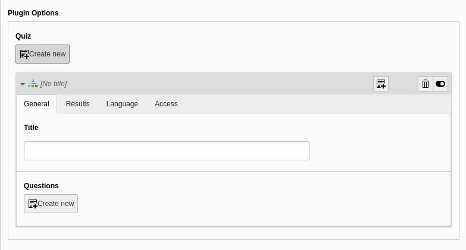

.. ==================================================
.. FOR YOUR INFORMATION
.. --------------------------------------------------
.. -*- coding: utf-8 -*- with BOM.

.. include:: ../Includes.txt

.. _user-manual:

Users Manual
============

To create a quiz, create a new content-element of type "Plugin" on the page where the quiz should be displayed and choose "Display Quiz" as selected plugin.

.. figure:: ../Images/UserManual/create-content.png
   :width: 500px
   :alt: content element

   create plugin "Display Quiz"

Now you can create a new quiz element in plugin options (just click "Create new"):

   create quiz

Define a title and create questions.

   create questions

Choose tab "Answers" and define the answers to that question along with their point value.

   create answers

Finally, choose Tab "Results" at the quiz level and define ranges and pages to redirect to.

   create results

